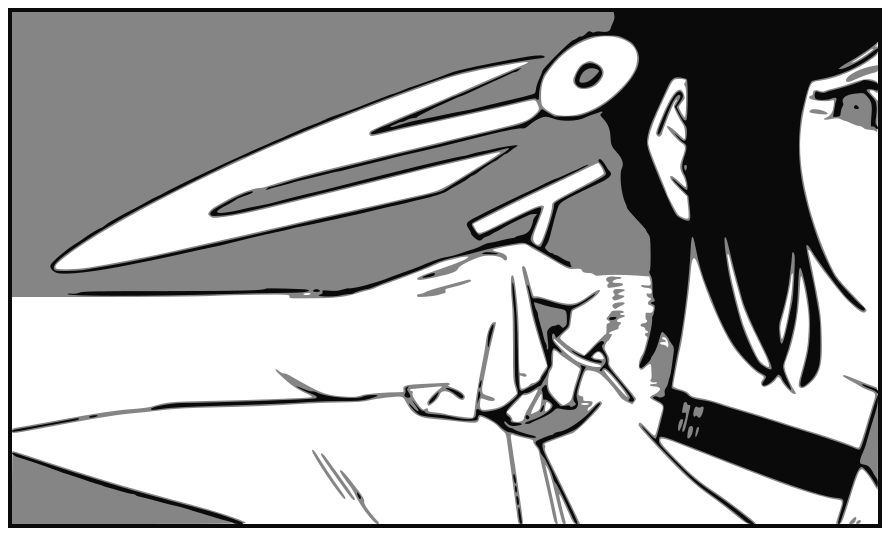

<div align="center">



# Reze

**A menu-bar app that turns short triggers into full prompts.**

</div>

---

Built for macOS. It also builds and runs on Linux under X11, with the
macOS-specific pieces degrading rather than breaking: the palette paints its own
surface instead of using the native blur, the tray gets the colour icon instead
of a template glyph, and expansion uses the selection fallback because the
keystroke tap is macOS-only. **Wayland is not supported** — it blocks synthetic
input into other applications by design, which is the mechanism this whole app
rests on.

Hit a global hotkey anywhere, type `full analysis`, press Enter — the paragraph
you actually meant gets pasted into whatever app you were already in.

```
┌──────────────────────────────────────────────────────────────┐
│ 🔍  full an                                              3   │
├──────────────────────┬───────────────────────────────────────┤
│ ▸ full analysis      │ Deep end-to-end read of a codebase    │
│   #review #analysis  │ ───────────────────────────────────── │
│   security audit     │ Be rigorous and concrete. Cite every  │
│   #review #security  │ claim with a `file:line` reference…   │
└──────────────────────┴───────────────────────────────────────┘
  ↵ select   ⌘↵ copy only   esc close          Edit macros
```

## Install

```bash
make
```

One command is the whole path: it stops any running copy, clears the stale
Accessibility entry left by a previous install, builds the app with bun, puts a
fresh **Reze.app** in `/Applications`, and launches it. After pulling changes,
`make update` runs the same refresh.

`make build` alone produces both bundles under
`src-tauri/target/release/bundle/` without touching `/Applications`:

| Path | What |
| --- | --- |
| `macos/Reze.app` | The app itself (~12 MB) |
| `dmg/Reze_<version>_aarch64.dmg` | Disk image (~4 MB) with a drag-to-`Applications` layout |

There is no Dock icon and no window on launch — it is a menu-bar app, so look
for the bomb glyph up top. Press `⌘⇧Space` to confirm it is alive.

Two things to know on first run:

- **Grant Accessibility when macOS asks.** The permission is tied to the exact
  binary, so a dev build, the installed app, and every rebuilt version of it
  are all separate entries — and a stale one can keep looking ticked in System
  Settings while being inert. `make` and `make update` reset the stale entry
  before installing, so the fresh app prompts cleanly; all that is left is to
  allow it. Until then the palette still works, and `⌘↵` still copies to the
  clipboard.
- **It is ad-hoc signed, not notarized.** Building and running it on your own
  machine is fine — locally built apps never get the quarantine flag. If you
  copy the `.dmg` to another Mac it *will* be flagged, and Gatekeeper will
  refuse to open it. There, either right-click the app → **Open**, or strip the
  flag: `xattr -dr com.apple.quarantine /Applications/Reze.app`. Signing it
  properly needs a paid Apple Developer ID.

`make build` targets the host architecture — `aarch64` on Apple Silicon. For a
binary that also runs on Intel Macs, build
`bun run tauri build --target universal-apple-darwin` (requires
`rustup target add x86_64-apple-darwin`).

To have it running from the moment you log in, turn on **Start Reze when I log
in** under Settings in the editor. That registers the app with macOS itself, so
it also appears under System Settings → General → Login Items — the two are the
same switch, and either one can turn it off. Needs macOS 13 or later, and the
installed `Reze.app` rather than a dev build.

Reinstalling replaces the app bundle and clears the registration along with the
Accessibility grant, so tick it again after `make update`.

## Using it

There are two ways in. **Search** it when you want to browse, or **expand in
place** when you already know the trigger.

### Expand in place

Type a trigger straight into whatever you are already writing in, then press
`⌥Space`:

```
Please do a full analysis|          ← your caret, in any app
                    ⌥Space
Please do a Be rigorous and concrete. Cite every claim with…
```

Reze replaces the trigger with the expansion. No window appears, and the rest of
the line is left exactly as it was. If the words match nothing, nothing happens
and your text is untouched.

It works this out in one of two ways:

1. **What it saw you type.** Reze keeps the last 160 characters you typed and
   backspaces over the trigger. This is the only approach that works in a
   terminal or any TUI — `Option+←` there is an escape sequence to the shell,
   not a selection, and `⌘C` copies the terminal's view selection rather than
   the line you are editing. See [Typing awareness](#typing-awareness).
2. **Selecting and reading back the words at your caret.** Used when the first
   has nothing to offer — text typed before Reze started, or pasted rather than
   typed. Works in ordinary text fields, not in terminals.

Matching ignores case and prefers the longest trigger, so with both `analysis`
and `full analysis` defined, typing "full analysis" expands the longer one. If
the macro has variables, the palette opens on its fill-in step and the
replacement happens once you submit.

This needs a real key combination — a bare `Tab` cannot be used, because a
global shortcut swallows that key in *every* application.

### The palette

| Key | Does |
| --- | --- |
| `⌘⇧Space` | Open the palette over the current app (configurable) |
| `↑` `↓` / `⌃N` `⌃P` | Move through results |
| `↵` | Expand and paste — or open the fill-in step if the macro has variables |
| `⌘↵` | Put the expansion on the clipboard instead of pasting |
| `esc` | Back out of fill-in, or close |

The tray icon opens the macro editor, where you can add, edit, tag, duplicate
and delete macros, rebind the hotkeys, change how expansions are delivered, and
set Reze to start at login.

### Quitting

Use **Quit Reze** in the tray menu, or `⌘Q` with the editor focused. A menu-bar
app has no application menu, so `⌘Q` has nothing to hang off by default — the
editor window handles it itself. `⌘W` there closes the window without quitting.

## Template syntax

Deliberately tiny — anything more expressive belongs in the prompt itself.

| Syntax | Meaning |
| --- | --- |
| `{{target}}` | A variable. The palette prompts you for it before pasting. |
| `{{target\|this codebase}}` | Same, pre-filled with a default. |
| `{{> rigor}}` | Inline another macro by its trigger, so shared preamble lives in one place. |
| `{{clipboard}}` | Whatever you last copied. |
| `{{date}}` `{{time}}` `{{datetime}}` | Filled automatically, never prompted. |

Includes nest, and a macro that (transitively) includes itself is reported in
the editor rather than recursing forever.

## Storage

Everything lives in `~/.reze/macros.json`, and **that file is the source of
truth** — the GUI is a convenience layer over it. Edit it in any text editor and
Reze picks up the change immediately; edit it in the app and your editor sees
the change on next read. Diff it, commit it, sync it however you like.

```jsonc
{
  "version": 1,
  "settings": {
    "hotkey": "CmdOrCtrl+Shift+Space",
    "expandHotkey": "Alt+Space", // expand the trigger at the caret
    "trackTyping": true,         // needed for expansion inside terminals
    "pasteMode": "paste",        // or "copy" to never paste directly
    "restoreClipboard": true
  },
  "macros": [
    {
      "id": "…",
      "name": "full analysis",
      "description": "Deep end-to-end read of a codebase",
      "tags": ["review"],
      "body": "{{> rigor}}\n\nFully and thoroughly analyze {{target|this codebase}}…",
      "usageCount": 0
    }
  ]
}
```

Two settings are deliberately not in here: the Accessibility grant and the
launch-at-login switch. Both are owned by macOS, and a copy of the answer in
this file would start lying the moment you changed it in System Settings — so
Reze reads them back from the OS instead of remembering them.

## Typing awareness

Expanding in a terminal requires knowing what you typed, and nothing can be
read back out of a terminal's line editor. So Reze watches typing instead:

- It keeps the **last 160 characters**, in memory only. Never written to disk,
  never sent anywhere.
- It is discarded on Enter, Tab, Escape, any arrow or navigation key, any mouse
  click, any keypress with a modifier held, and whenever you switch apps.
- macOS disables event taps entirely while **secure input** is active, so
  password fields are never observed — not by policy, but by the OS.
- Turn it off with `trackTyping` in Settings. Expansion then falls back to
  selecting the words at your caret, which works in normal text fields but not
  in a terminal.

Only implemented on macOS. Elsewhere the selection fallback is always used.

The tap needs Accessibility permission to exist at all, so granting it *after*
launch leaves it uninstalled. Reze retries on the next expansion rather than
making you restart — that one attempt still falls back to selection.

## Accessibility permission

macOS has no supported way to inject text into another app, so pasting works by
putting the expansion on the clipboard and synthesizing `⌘V`. Expanding in place
additionally selects and copies the words before your caret to find out what you
typed. Both need **Accessibility** permission, and without it the keystrokes are
silently swallowed — the palette opens, and nothing arrives.

The editor shows a banner with a button that jumps straight to
System Settings → Privacy & Security → Accessibility when the permission is
missing. Your previous clipboard contents are restored a moment after the paste
lands (turn that off in Settings if you'd rather they weren't).

Note that the permission is granted per-binary: the dev build and a bundled
`Reze.app` are separate entries, and each needs granting once.

## Development

```bash
bun install
bun run tauri dev      # run it
bun run tauri build    # produce Reze.app + a .dmg in src-tauri/target/release/bundle
```

- `assets/icon.svg`, `assets/tray.svg` — icon sources (see below)
- `src-tauri/src/store.rs` — the JSON library, its schema, and the seed macros
- `src-tauri/src/paste.rs` — clipboard + synthesized keystrokes, and the permission check
- `src-tauri/src/expand.rs` — which trigger the typed words name (`cargo test`)
- `src-tauri/src/typed.rs` — the keystroke tap behind terminal support
- `src-tauri/src/focus.rs` — remembering who had focus, and pasteboard change detection
- `src-tauri/src/login.rs` — the launch-at-login switch, via `SMAppService`
- `src-tauri/src/lib.rs` — windows, tray, global hotkeys, file watcher, IPC commands
- `src/lib/template.ts` — the template language (variables, includes, built-ins)
- `src/lib/fuzzy.ts` — the palette's ranking
- `src/Palette.tsx`, `src/Editor.tsx` — the two windows, routed by window label

Both windows load the same bundle; `main.tsx` picks a component from
`getCurrentWindow().label`.

## Icons

Original artwork, hand-written SVG, in `assets/`. Both are a bomb-head wearing a
pulled grenade pin — a nod to the Bomb Devil's pin-in-the-neck that doubles as
the app's premise: pull a tiny pin, get an explosion.

| Source | Becomes | Notes |
| --- | --- | --- |
| `assets/icon.svg` | `src-tauri/icons/*` incl. `icon.icns`, `icon.ico` | Authored at 1024² with the macOS icon grid baked in (824² body, 100px margin), so generation only ever downscales. |
| `assets/tray.svg` | `src-tauri/icons/tray.png` | The menu-bar glyph. |

Regenerate both after editing either SVG (needs `rsvg-convert` — `brew install librsvg`):

```bash
bun run icons
```

The tray glyph is a macOS **template image**: pure black plus alpha, nothing
else. The system ignores the colour and tints the alpha itself, so it comes out
white on a dark menu bar and black on a light one automatically — drawing it
white would break that. `tray-icon` normalises menu-bar images to 18pt tall
preserving aspect ratio, so the glyph is authored square at 72px (4× for
Retina) with deliberately fat strokes that survive the downscale. It is
embedded with `include_bytes!` rather than bundled as a resource, so it cannot
go missing at runtime.

## Building

Always build with `bun run tauri build` (what `make build` runs) and install
the whole `.app`.

Running `cargo build` and copying just the binary over an installed bundle
looks like it works and does not: the frontend is embedded at compile time, and
a partially-rebuilt binary can end up with an `index.html` that references an
asset hash the embedded map no longer has. The window then loads, `#root` stays
empty, and no error surfaces anywhere — the app simply does nothing. If you ever
see that, `cargo clean -p reze` and build again properly.

## License

MIT — see [LICENSE](LICENSE).
